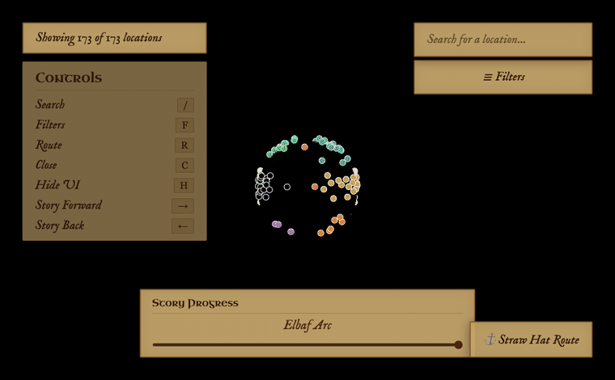
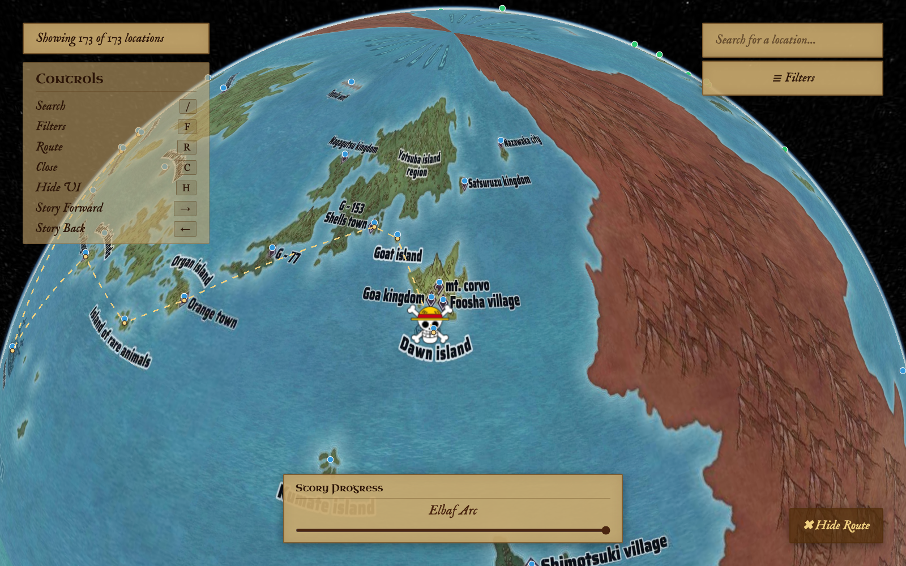
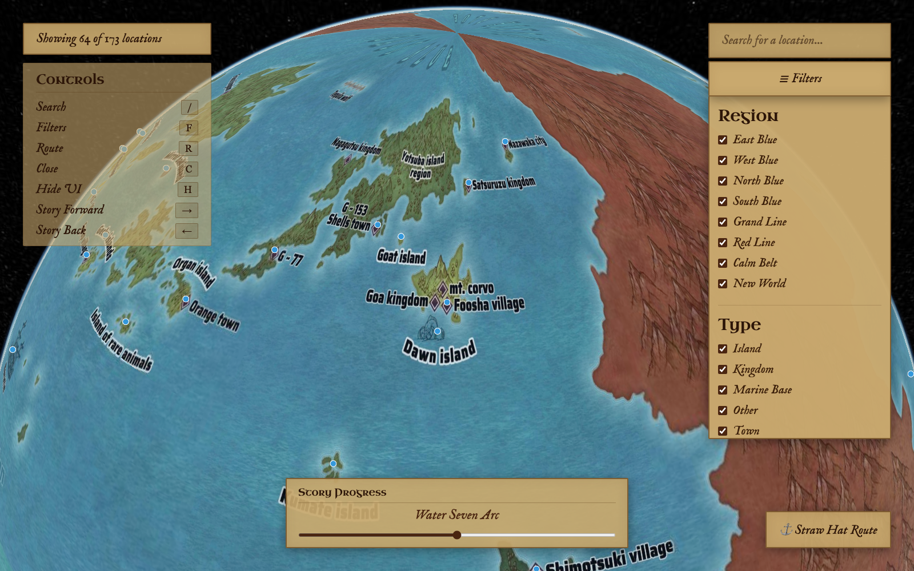
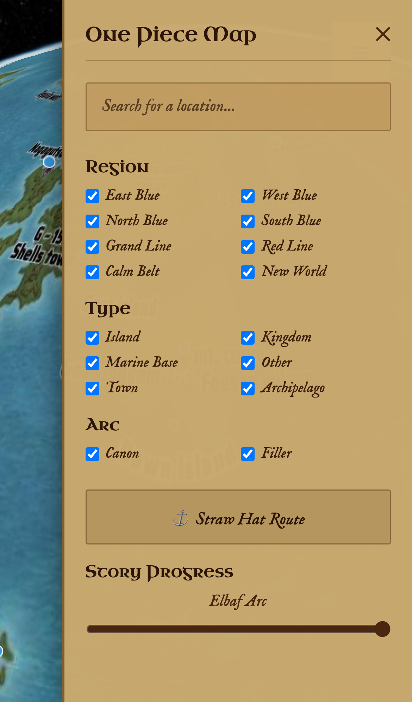
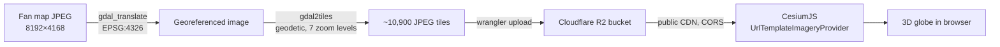

# One Piece Interactive World Map

A Google Earth–style 3D globe of the One Piece world — 173 hand-pinned locations, spoiler-aware filtering, and an animated route overlay, built on a custom GDAL tile pipeline served from Cloudflare R2.

[](https://grandline3d.com/)
[](https://github.com/TahaDeol/one-piece-3d-map/actions/workflows/ci.yml)
[](https://cesium.com)
[](https://developers.cloudflare.com/r2/)
[](https://vercel.com)

---



| Route overlay | Filter panel | Mobile drawer |
|---|---|---|
|  |  |  |

---

## ✨ Features

- **3D interactive globe** — rotate, zoom, and fly around the One Piece world rendered on a WebGL globe
- **173 location markers** — color-coded by sea region, manually pinned using a custom coordinate recording tool
- **Spoiler-aware filtering** — a story-progress slider hides locations beyond the selected arc, in canonical order, everywhere (map, search, counters)
- **Straw Hat route overlay** — an animated Jolly Roger ship interpolates across 36 waypoints at a speed proportional to each leg's real distance
- **Live search** — dropdown suggestions that respect every active filter (region, type, canon/filler, story progress), not just some of them
- **Deep-linkable URL state** — every location view is a shareable link; the app restores it on load

---

## 🛠 How It's Built

The source map is a single 8192×4168 JPEG (~12.8 MB). Loading that as one texture on a WebGL globe would mean downloading the whole thing before anything renders — and re-rendering an enormous flat image onto a sphere is exactly the kind of thing that stutters on a mid-range laptop.

Instead, the image is sliced into a tile pyramid: 7 zoom levels, each one twice the resolution of the last, chopped into 256×256 JPEG tiles. CesiumJS then only requests the tiles that are actually on screen at the current zoom level — a few hundred KB at the initial cinematic view instead of 12.8 MB up front, growing only as the user zooms in.



**Why geodetic, not Mercator.** The first version tiled the map with GDAL's `mercator` profile — the same projection Google Maps uses. Mercator is mathematically undefined past ±85.05° latitude, so squeezing a full ±90° source image through it stretched and warped everything near the poles. Since this is a fan map, not a navigational chart, there's no reason to pay that penalty: the tiles are generated with GDAL's `geodetic` (plate carrée) profile instead, paired with Cesium's `GeographicTilingScheme`, which represents the full latitude range linearly — no distortion, and incidentally about half the redundant tile coverage Mercator's square-grid framing would have produced.

**Numbers:** the initial view fetches on the order of 150–200 tiles (under 2 MB) instead of the 12.8 MB source image — the whole tile set is ~10,900 files totaling roughly 50 MB, but a given session only ever touches the tiles it can see.

---

## 🛠️ Tech Stack

| Tool | Purpose |
|------|---------|
| [CesiumJS](https://cesium.com) | 3D globe rendering, camera animations, entity markers |
| [GDAL](https://gdal.org) | Slicing the fan map into a 7-level geodetic tile set |
| [Cloudflare R2](https://developers.cloudflare.com/r2/) | Hosting the tile set with public CDN access |
| [Vercel](https://vercel.com) | Static site deployment with GitHub auto-deploy |
| Vanilla JavaScript (ES modules) | All application logic — no framework, no build step |
| CSS3 | Parchment UI theme with `Uncial Antiqua` and `IM Fell English` fonts |

---

## 🚀 Getting Started

### Prerequisites

- Node.js (for local server)
- GDAL (for tile generation)
- A [CesiumJS Ion](https://ion.cesium.com) token (free tier works)

### Installation

```bash
git clone https://github.com/TahaDeol/one-piece-3d-map.git
cd one-piece-3d-map
```

### Generate Map Tiles

Tiles are not tracked in Git. Generate them locally from the source map image:

```bash
gdal_translate -a_srs EPSG:4326 -a_ullr -180 90 180 -90 \
  images/one-piece-map.jpg images/one-piece-map-geo.jpg

# Note the zoom offset: gdal2tiles' geodetic zoom 0 is a squashed 1x1 tile,
# but Cesium's GeographicTilingScheme level 0 is already a 2x1 grid — a
# one-level mismatch. Generate zoom 1-7, then rename directories down by
# one (1->0 ... 7->6) so folder names match the levels Cesium requests.
gdal2tiles.py --profile=geodetic --zoom=1-7 \
  --webviewer=none --no-kml --tiledriver=JPEG \
  images/one-piece-map-geo.jpg tiles-raw/

mkdir tiles
for z in 1 2 3 4 5 6 7; do mv "tiles-raw/$z" "tiles/$((z - 1))"; done
rm -rf tiles-raw
```

### Run Locally

```bash
npm install -g serve
serve .
```

Open `http://localhost:3000`

---

## 🗂️ Project Structure

```
one-piece-3d-map/
├── index.html            # Main application entry point
├── recorder.html         # Internal coordinate recording tool
├── src/
│   ├── main.js           # Bootstrap — wires everything together
│   ├── viewer.js         # Cesium init, imagery provider, camera, zoom behavior
│   ├── config.js         # Region colors, arc order, arc display names
│   ├── markers.js        # Entity creation
│   ├── infoPanel.js      # Info panel + globe click/hover picking
│   ├── filters.js        # Region/type/arc/story-progress filtering
│   ├── search.js         # Search query matching + dropdowns (desktop + mobile)
│   ├── route.js          # Straw Hat route — waypoint interpolation, ship animation
│   ├── urlState.js       # Query-string read/write, deep-link restore
│   ├── keyboard.js       # Keyboard shortcuts
│   ├── mobileMenu.js     # Mobile drawer open/close
│   ├── data/
│   │   └── locations.js  # Location data loader
│   ├── map.css            # All styling — loading screen, panels, theme
│   ├── recorder.js        # Coordinate recording tool logic
│   └── recorder.css       # Recorder tool styling
├── data/
│   └── locations.json    # 173 locations with coordinates and metadata
├── assets/
│   └── straw-hat-jolly-roger.png
└── tiles/                 # Generated map tiles (not tracked in git)
```

Desktop and mobile search/route/filter handlers are intentionally
duplicated within their feature's file (e.g. both search bars live in
`search.js`) rather than split by platform — a search bug fix should
only ever require touching one file, not two.

---

## ⌨️ Keyboard Shortcuts

| Key | Action |
|-----|--------|
| `/` | Focus search bar |
| `F` | Toggle filter panel |
| `R` | Toggle Straw Hat route |
| `C` | Close all panels |
| `H` | Hide / show all UI |
| `←` `→` | Step story progress backward / forward |

---

## 🌊 Region Color Key

| Region | Color |
|--------|-------|
| East Blue | 🔵 Blue |
| West Blue | 🟣 Purple |
| North Blue | 🟢 Green |
| South Blue | 🟠 Orange |
| Grand Line | 🟡 Gold |
| New World | ⚫ Black |
| Calm Belt | ⚪ White |
| Red Line | 🔴 Red |

---

## 📦 Data

All 173 location coordinates were manually recorded using a custom-built coordinate recording tool (`recorder.html`) that logs clicked globe positions to JSON. Each entry includes name, sea region, location type, story arc, and lore notes.

---

## 🙏 Credits

- Map image by [Xads181](https://www.deviantart.com/xads181) on DeviantArt (labelless version)
- One Piece is created by Eiichiro Oda / Shueisha

---

<div align="center">
  <i>The One Piece is Real.</i> 🏴‍☠️
</div>
